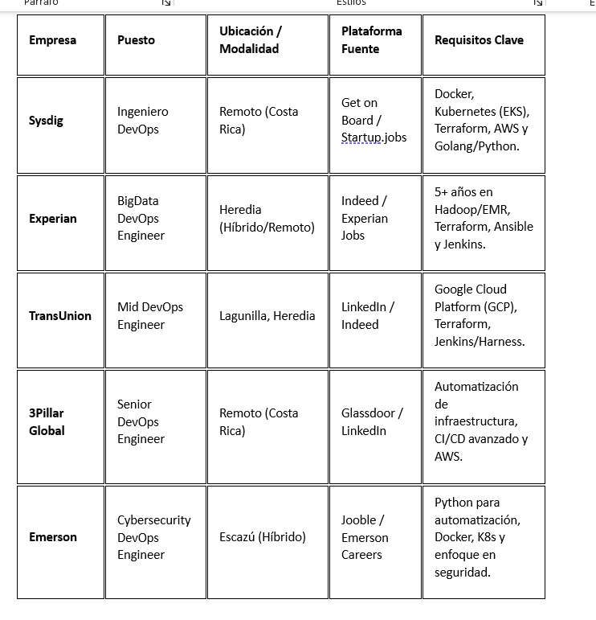

Trabajo de mis sueños

Parte 1 Investigación del Trabajo Soñado
	Vacantes de DevOps Engineer en Costa Rica

imagen detallada de las vacantes: 

Justificación de perfil profesional buscado:

1. Sysdig: Ingeniero DevOps (Enfoque Cloud Native)
•	Nombre del puesto: Ingeniero DevOps.
•	Tecnologías requeridas: AWS (EKS, Fargate), Docker, Kubernetes, Terraform, Golang, Python, Kafka, Cassandra.
•	Habilidades técnicas (Hard Skills): Automatización de infraestructura (IaC), diagnóstico de problemas complejos en servicios de red, gestión de sistemas Linux y optimización de carga.
•	Habilidades blandas (Soft Skills): Pragmatismo, actitud accesible ("hands-on"), capacidad de "naturalizar" mejores prácticas y comunicación asertiva.
•	Responsabilidades principales: Automatizar implementaciones en la nube, optimizar plataformas de procesamiento de datos e inculcar la cultura DevOps en equipos multidisciplinarios.

2. Experian: BigData DevOps Engineer
•	Nombre del puesto: BigData DevOps Engineer.
•	Tecnologías requeridas: Hadoop, AWS EMR, Terraform, Jenkins, Kafka, Spark, Hive, Kubernetes (EKS), Ansible.
•	Habilidades técnicas (Hard Skills): Administración de ecosistemas Big Data, afinación de clusters, seguridad en redes (Kerberos/LDAP) y despliegues de CI/CD para pipelines de datos.
•	Habilidades blandas (Soft Skills): Capacidad de colaboración en equipos geográficamente distribuidos, enfoque en la mejora continua y resolución proactiva de incidentes.
•	Responsabilidades principales: Gestionar entornos de Big Data, automatizar el aprovisionamiento de recursos AWS con Terraform y garantizar la alta disponibilidad de plataformas críticas.

3. TransUnion: Mid DevOps Engineer (GCP Focus)
•	Nombre del puesto: Mid DevOps Engineer.
•	Tecnologías requeridas: Google Cloud Platform (GCP), Jenkins, Harness, Terraform, Kubernetes (GKE), Python, Bash.
•	Habilidades técnicas (Hard Skills): Desarrollo de módulos en Terraform, gestión de microservicios sin estado, monitoreo con Prometheus/Grafana y gobernanza de nube.
•	Habilidades blandas (Soft Skills): Pensamiento crítico, capacidad para trabajar bajo presión con plazos cambiantes y honestidad profesional.
•	Responsabilidades principales: Diseñar y mantener infraestructuras escalables en GCP, optimizar pipelines de despliegue y asegurar el cumplimiento de normativas de seguridad (Infosec).

4. 3Pillar Global: Senior DevOps Engineer (Azure/AWS)
•	Nombre del puesto: Senior DevOps Engineer.
•	Tecnologías requeridas: Azure, AWS, Terraform, Docker, Kubernetes, Bicep, ARM, PowerShell, AppInsights.
•	Habilidades técnicas (Hard Skills): Arquitectura de Landing Zones, gestión de certificados y mTLS, scripting avanzado para Saas y liderazgo técnico.
•	Habilidades blandas (Soft Skills): Mentoría de perfiles junior, comunicación técnica para audiencias no técnicas y visión estratégica global.
•	Responsabilidades principales: Recomendar mejores prácticas de arquitectura cloud, guiar a equipos cross-funcionales y liderar la estrategia de automatización organizacional.

5. Emerson: Cybersecurity DevOps Engineer
•	Nombre del puesto: Cybersecurity DevOps Engineer.
•	Tecnologías requeridas: Azure, Python, Docker, Kubernetes, Git, Terraform/Ansible, ArgoCD.
•	Habilidades técnicas (Hard Skills): Codificación segura (Secure Coding), ingeniería de herramientas para respuesta a incidentes, orquestación de contenedores y GitOps.
•	Habilidades blandas (Soft Skills): Adaptabilidad en entornos de ritmo rápido, propiedad ("ownership") del producto y capacidad analítica para problemas de seguridad.
•	Responsabilidades principales: Desarrollar aplicaciones en Python para equipos de ciberseguridad, mantener entornos escalables en Azure y diseñar pipelines que integren escaneos de vulnerabilidades.
Patrones comunes en los empleos
Después de "escanear" lo que piden las empresas top en el país, estos son los 4 pilares que todos exigen:
•	 Plataformas: Terraform (para crear infraestructura) y Kubernetes (para manejar contenedores), estás fuera del juego. Es el estándar de oro en Costa Rica.
•	Nubes dominantes: Casi todo el mercado tico se mueve en AWS (Amazon) o Azure (Microsoft).
•	Código real: Ya no solo se trata de configurar,  programar en Python o Go para automatizar tareas.
•	Inglés fluido: Al ser empresas globales, el idioma es la herramienta técnica más importante después de la computadora.

 Perfil profesional:
Cloud & Platform Engineer (Especialista en Automatización) es el puente entre el código y la estabilidad ,hace   plataformas automáticas, seguras y rápidas que permitan a los desarrolladores trabajar sin obstáculos.

Enfoque web desarrollado:
¿Por qué este enfoque? Porque en DevOps, un currículum en papel no demuestra que sabes programar infraestructura. Un sitio web te permite mostrar:
•	Diagramas reales de arquitecturas que has diseñado.
•	Botones directos a tu código en GitHub.
•	Casos de éxito "se explica cómo arreglar un problema grave". Esto saca de la fila de candidatos comunes y hace que un candidato(a)  en la lista de "expertos" que los reclutadores de empresas como Emerson o 3Pillar buscan.

Diferencias clave:
1.	Enfoque en FinOps (Ahorro de dinero): En tiempos de crisis, un ingeniero que sabe cómo bajar la factura de la nube y sesto se destaca entre otros  de la empresa.
2.	Cultura de Autogestión: La diferencia es no de pender y estar pendiente de recibir y dar órdenes constantes ,para eso se construyen herramientas para que los demás puedan trabajar automáticamente sin necesidad de estar dándoles ordenes todo el día. 

Parte 2: Diseño y Prototipado : 

Este apertado se relizó con la ayuda de la herramienta Figma una prueba de como se queria visualizar mi sitio web  de forma casi automatica , esto permite que se peda tener una idea más clara de lo que se desea tener implementado en una web , sy todod esto sin escribir ni una sola línea de código.

Enlace del diseño de figma:https://www.figma.com/make/m8JWr0wNtPBGcC58NIgBlT/Landing-page-design?t=Ni8fdf2OKxsVjkcH-20&fullscreen=1

Parte 3: Desarrollo Web: 

Se desarrollo este sitio web por medio de Html puro y css.

Parte 4: Presentación en Clase:

Porque eleguí Ingennier DevOps como mi trabajo deseado?

Un ingeniero devOps es el puente entre la parte técnica y la parte administrativa , esta mezcla de actividades ,como tener  conocimientos en distintas areas ,programación(varios lenguajes), estructuras de las máquinas por dentro y fuera , manejo de archivos , interacción con personas etc, esta mezcla es lo que hace esta labor tan interesante e importante , ya que no se enfoca en una sola área en específico si no que involucra más participación en basicamente todas etapas de los proyectos , es por eso que me gustaría en un futuro poder trabajar en algo similar.
